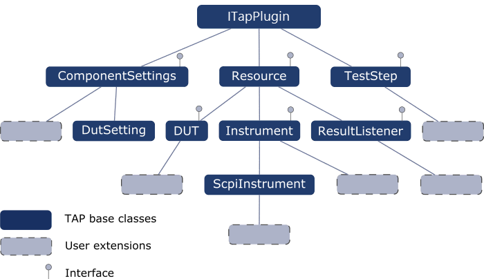

Development Essentials
==================

## OpenTAP Plugin Object Hierarchy

At the very root of the OpenTAP plugin class hierarchy is the **ValidatingObject** class. Items in blue are OpenTAP base classes. The green, dotted rectangles are user extensions to those base classes.

 
 
 Extending **ValidatingObject** are the **ComponentSettings**, **Resource**, and **TestStep** base classes. These are abstract classes and hence cannot be instantiated. They are used as base classes for other classes.
 
-	**ComponentSettings** is used for storing settings throughout the system. It contains properties to be set or lists of instruments, DUTs, and so on. ComponentSettings are available via the various Settings menus in the GUIs.

-	**Resource** is a base class for the DUT, Instrument and ResultListener classes. Resources are often specified in the settings for a test step. Referencing a 'Resource' from a test step will cause it to automatically be opened upon test plan execution. 

-	**TestStep** does not inherit from Resource but inherits directly from ValidatingObject.

## Developing Using Interfaces

Developers may choose to NOT extend the OpenTAP base classes, but instead to implement the required interfaces. You can inherit from as many interfaces as you want, but from only one class. The TestStepInterface.cs file provides an example of implementing ITestStep.

Developers implementing IResource (required by virtually all other OpenTAP plugin classes), must ensure that the implementation of:

-	IResource.Open sets IsConnected to true, and 
-	IResource.Close sets IsConnected to false.

## Working with User Input

It is possible to request information from the user via the `UserInput` class. You can use this in both the CLI and a GUI. In a GUI, this allows you to create a pop-up dialog the user can interact with.

The `UserInput.Request` method takes three parameters:

- `dataObject` - the object the user needs to provide. Can be a test step, an instrument or a DUT among others.
- `Timeout` - specify how long to wait for the user input. After the specified amount of time an exception will be thrown.
- `modal` - a Boolean that specifies if the user can interact with background objects if the dialog is open. If it is set to true the user will have to answer before doing anything else.

To finalize the input you can use the [`SubmitAttribute`](../Attributes/Readme.md#submit-attribute). If this is used in a GUI with an enum, buttons appear that can submit or cancel the user input. In this case we recommend using the `SubmitAttribute` together with the [`LayoutAttribute`](../Attributes/Readme.md#layout-attribute). This helps to create a natural look-and-feel for your UI because it handles how the buttons are displayed. You can use this attribute to control the height, width and placement of the buttons. To give a title to your dialog box you can use the `Create Name` property.

## Best Practices for Plugin Development

The following recommendations will help you get your project off to a good start and help ensure a smooth development process:

-	You can develop one or many plugins in one Visual Studio project. The organization is up to the developer. The following is recommended:
    -	Encapsulate your logic. Keeping all instrument logic inside the instrument class makes it possible to swap out instruments without changing TestSteps. For example, a TestStep plugin knows to call **MeasureVoltage**, and the instrument plugin knows how to get that measurement from its specific instrument.  
    -	You can put Instruments, DUTs, and TestSteps all in separate packages and create a "plug-and-play" type of interaction for test developers. For example, you can create test steps that make a measurement and plot a result. If done properly, the steps work regardless of which instrument gets the data or what type of device is being tested.

-	Don't introduce general settings unless absolutely necessary. Instead try to move general settings to test steps (such as a parent step holding settings for a group of child steps) or to DUT or Instrument settings.

-	For DUTs, Instruments, and Result Listeners, set the Name property in the constructor, so that this Name appears in the Resource Bar.

-	Use the **Display** attribute (with a minimum of name and description) on properties and classes. This ensures good naming and tooltips in the GUI Editor.

-	Use **Rules** for input validation to ensure valid data.

## Embedding OpenTAP in other Applications   
It is possible to embedd OpenTAP in custom applications and tools such as operator UIs. In this case, it is important to properly load and reference OpenTAP DLLs and install locations in order to keep the custom applications isolated if support for side-by-side installs of OpenTAP is desired.   
    
Mainly, this invovles how the OpenTAP DLL is discovered. This can be done in a few different ways:   
   
- When running within a tap.exe process:     
    - `OpenTap.PluginManager.GetOpenTapAssembly().Location;`     
    - `System.Reflection.Assembly.GetEntryAssembly().Location;`   
        
- Outside the tap.exe process:   
    - It is recommended to find the install path using a registry key. The registry key that this generates should be in `HKEY_LOCAL_MACHINE\SOFTWARE\Keysight\Test Automation\Installations` or `HKEY_CURRENT_USER\SOFTWARE\Keysight\Test Automation\Installations` depending on whether `tap path register` / `tap package install OSIntegration` was running elevated (like e.g. during in a KS8400 installation).     
    - You can look this Registry Key up from code using the standard .NET API: `Registry.LocalMachine.OpenSubKey`   
     
- From the CLI you can us the OS Integration Package:   
    ```
    > tap package install OSIntegration
    Downloaded 'OSIntegration' to 'c:\git\opentap\bin\Debug\PackageCache\OSIntegration.1.3.0+f4db057d.TapPackage'. 
    [616 ms]
    Installing to C:\git\opentap\bin\Debug
    Installed OSIntegration version 1.3.0+f4db057d [833 ms]
    > tap path register .  // not actually necessary in this case as installing the package automatically does this
    Registered installation in c:\git\opentap\bin\Debug.
    > tap path list
    OpenTAP  c:\git\opentap\bin\Debug
    OpenTAP  C:\git\tap\bin\Debug
    TAP_PATH C:\Program Files\Keysight\Test Automation
    OpenTAP  c:\Program Files\OpenTAP
    ```  
   
- If desired, you can set a custom path as part of a Package Action on Plugin install:
```xml
 <PackageActionExtensions>
     <ActionStep ActionName="install" ExeFile="cmd" Arguments="/c setx MY_UTIL_INSTALL_DIR %cd%"/>
</PackageActionExtensions>	
 ```   

  
Note that the environment variable TAP_PATH may exist, however, this is for legacy reasons only and should **NOT** be used.